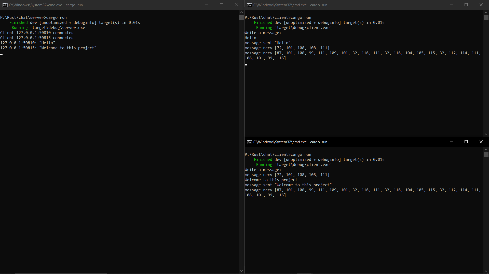
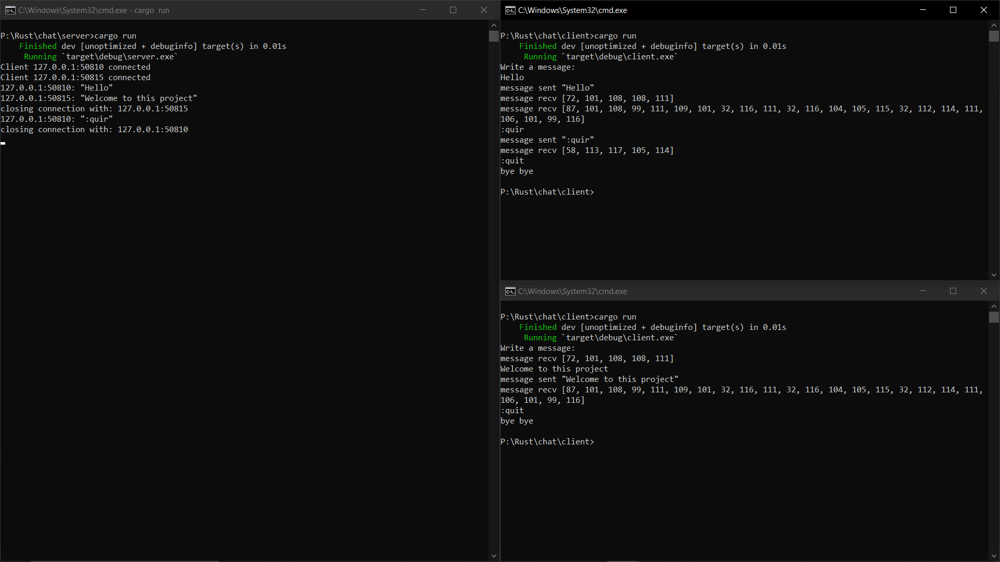

# CLI Chat Application

## About:
- The project contains 2 parts
- A server for receiving a message
- A client for sending

## Function:
- A server can accept multiple client connections
- Each client have a unique port generated upon creation

# Installation
**Recommended way (building from source):**\
=== *Please note: building from source takes **a lot of CPU and RAM** usage.* ===\
You need to have installed:
- [Rust](https://www.rust-lang.org/tools/install) 

If you want to or already have went through the hassle of installing Rust, you can ```git clone``` this repository, then ```cargo build --release```.

## To run the app
- ```cd server``` and run `cargo run`
- ```cd client``` and run `cargo run`

# Sreenshot


- To quit the client type ```:quit```


